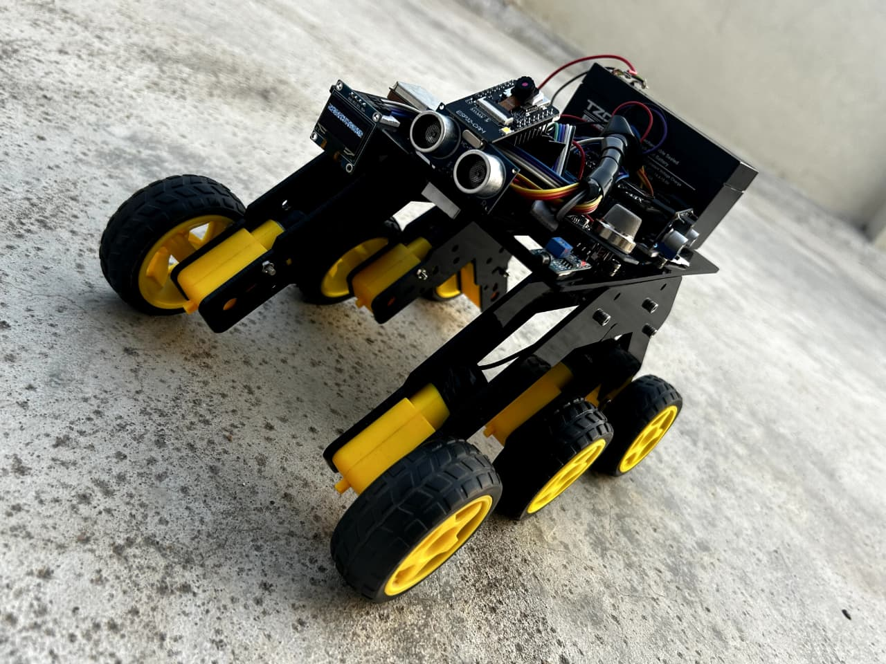
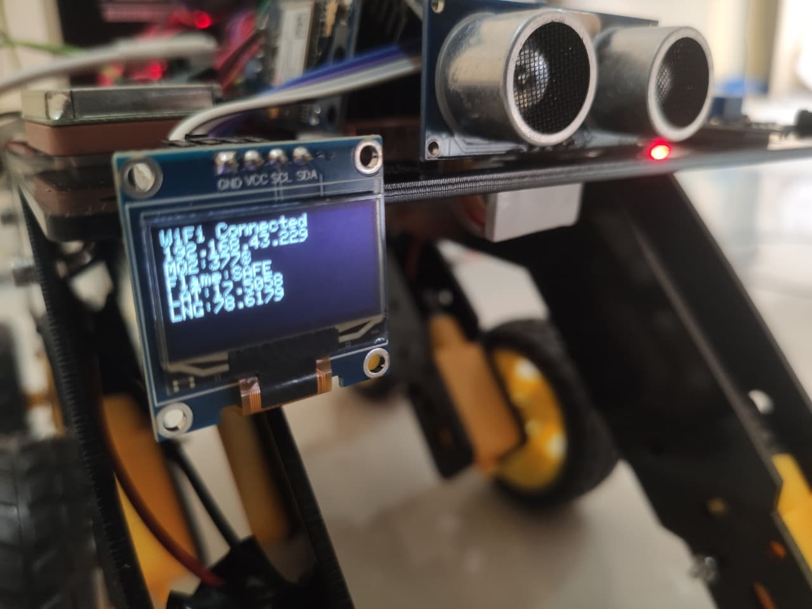
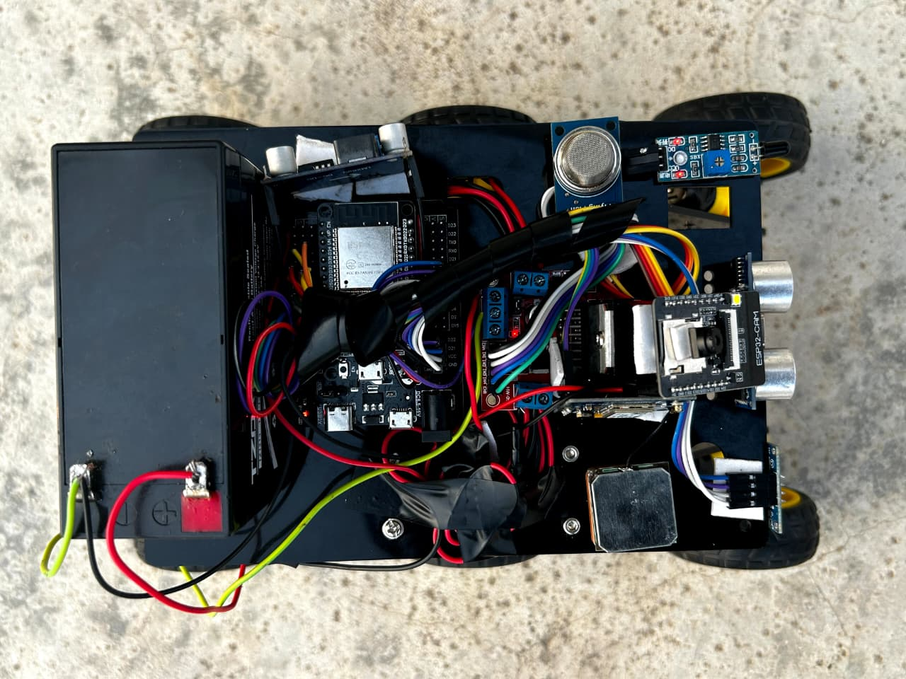
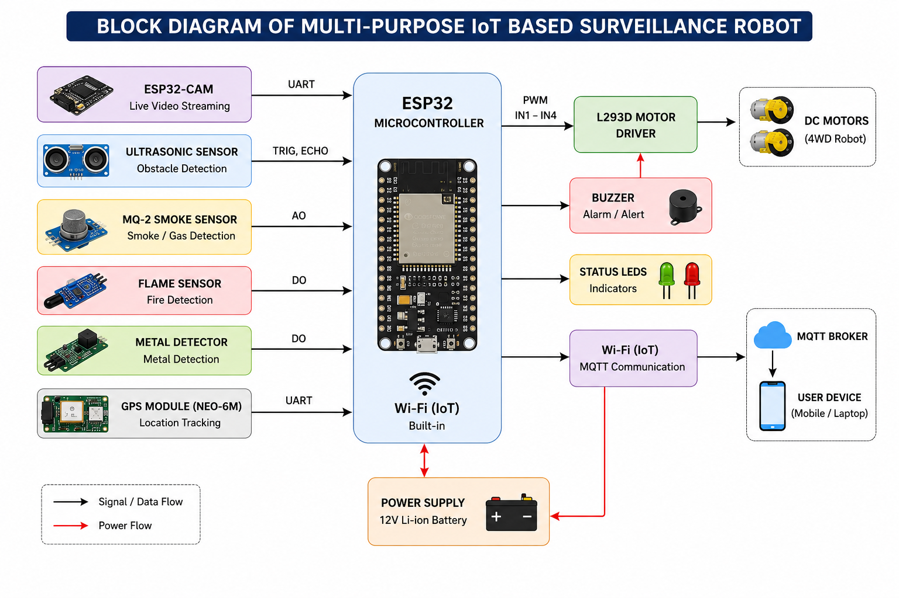
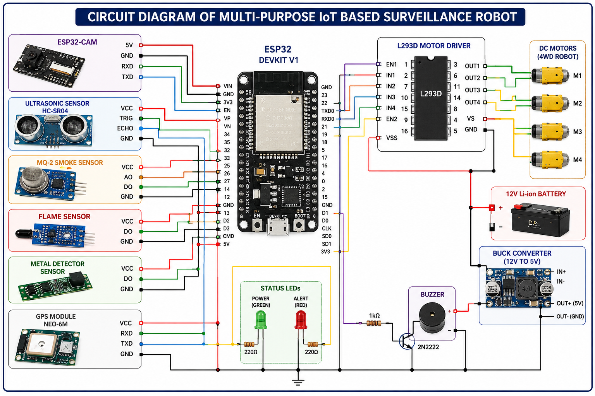

# 🤖 Multi-Purpose IoT Based Surveillance Robot

## 📌 Overview

The Multi-Purpose IoT Based Surveillance Robot is an ESP32-based intelligent robotic platform developed for real-time security, monitoring, and surveillance applications. The system integrates live video streaming, GPS location tracking, smoke detection, flame detection, metal detection, obstacle avoidance, and MQTT-based IoT communication. The robot can be remotely monitored and controlled through a wireless network, making it suitable for smart surveillance and hazard detection applications.

---

## 🚀 Features

- 📷 ESP32-CAM Live Video Streaming
- 🌍 GPS Location Tracking
- 🔥 Flame Detection and Alert System
- 💨 Smoke and Gas Detection using MQ2 Sensor
- 🧲 Metal Detection System
- 🚧 Ultrasonic Obstacle Detection
- 📡 MQTT-Based IoT Communication
- 📱 Remote Monitoring and Control
- 🚨 Real-Time Alerts and Notifications
- 🔋 Battery Powered Mobile Robot
- 🖥 OLED Status Display
- 🚗 4WD Robotic Navigation Platform

---

## 🛠 Hardware Components

- ESP32 Development Board
- ESP32-CAM Module
- GPS Module (NEO-6M)
- MQ2 Smoke/Gas Sensor
- Flame Sensor
- Metal Detector Sensor
- Ultrasonic Sensor (HC-SR04)
- OLED Display
- L293D Motor Driver
- DC Gear Motors
- Buzzer
- LEDs
- 12V Battery
- 4WD Robot Chassis

---

## 💻 Software & Technologies

- Arduino IDE
- Embedded C/C++
- ESP32 Libraries
- ESP32-CAM Library
- MQTT Protocol
- Wi-Fi Communication
- GPS Tracking
- IoT Monitoring Systems

---

## ⚙️ System Architecture

The ESP32 acts as the central controller and interfaces with multiple sensors including smoke, flame, metal detector, GPS, and ultrasonic modules. The ESP32-CAM provides live video streaming while MQTT enables real-time communication and alert notifications. The motor driver controls the robot movement, allowing remote navigation and surveillance.

---

## 📷 Project Images

### Robot Front View



### OLED Monitoring Display



### Top View Hardware Integration



---

## 🔌 Circuit & Block Diagrams

### Block Diagram



### Circuit Diagram



---

## 📂 Repository Structure

```text
Multi-Purpose-IoT-Based-Surveillance-Robot
│
├── Source_Code
│   ├── ESP32_CAM_HUMAN_ALERT.ino
│   ├── esp_camcontrol26b.ino
│   └── README.md
│
├── Images
│   ├── robot_front_view.jpg
│   ├── robot_oled_display.jpg
│   ├── robot_top_view.jpg
│   └── README.md
│
├── Circuit_Diagram
│   ├── block_diagram.jpg
│   ├── circuit_image.jpg
│   └── README.md
│
├── Documentation
│   ├── Final_Project_Report.pdf
│   └── README.md
│
├── README.md
├── LICENSE
└── .gitignore
```

---

## 📊 Applications

- Smart Surveillance Systems
- Industrial Safety Monitoring
- Hazard Detection
- Security and Patrol Robots
- Military Reconnaissance
- Smart City Monitoring
- Disaster Management Systems
- Remote Inspection Applications

---

## 🎯 Skills Demonstrated

- Embedded Systems Development
- ESP32 Programming
- IoT System Design
- Sensor Interfacing
- GPS Integration
- Wi-Fi Communication
- MQTT Protocol
- Robotics Engineering
- Hardware Integration
- Troubleshooting & Debugging

---

## 🚀 Future Scope

- AI-Based Object Detection
- Face Recognition System
- Cloud Data Logging
- Autonomous Navigation
- Mobile App Integration
- Real-Time Video Recording
- Advanced Threat Detection
- Edge AI Deployment on ESP32

---

## 📖 Documentation

Detailed project documentation is available in:

```text
Documentation/Final_Project_Report.pdf
```

---

## 👨‍💻 Author

**P. Venkatesh Sagar**

B.Tech – Electronics & Communication Engineering

Embedded Systems | IoT | Robotics

📍 Hyderabad, Telangana, India

🔗 LinkedIn: www.linkedin.com/in/p-venkatesh-sagar-528715256

---

⭐ If you found this project interesting, consider giving it a star!
